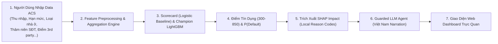

# Implementation Plan — Alternative Credit Scoring (ACS) Pipeline & POC

**Phiên bản:** 2.0  
**Ngày cập nhật:** 2026-08-05  
**Trọng tâm:** Khai thác **Dữ Liệu Thay Thế (Alternative Data)** để đánh giá rủi ro tín dụng cho đối tượng **Thin-file / Unbanked**, ứng dụng phương pháp luận **Feature Engineering phái sinh sâu** và **Đánh giá độ ổn định (Gini Stability)** rút ra từ **2 bài báo / giải pháp Top-1 Kaggle**.

---

## 1. Định Định Bài Toán Alternative Credit Scoring (ACS)

### 1.1 Khái niệm & Khách hàng Mục tiêu
- **Alternative Credit Scoring (ACS)**: Phương pháp chấm điểm tín dụng dựa trên các nguồn dữ liệu phi truyền thống (Alternative Data) thay vì chỉ phụ thuộc vào báo cáo nợ từ Trung tâm Thông tin Tín dụng Quốc gia (CIC).
- **Đối tượng áp dụng**: Người trẻ, học sinh/sinh viên, người lao động tự do, nông dân, hoặc các cá nhân lần đầu tiếp cận tín dụng (**Thin-file / Unbanked**).

### 1.2 Phân Loại Nhóm Dữ Liệu Thay Thế (Alternative Data Taxonomy)

| Nhóm Dữ Liệu | Các Thuộc Tính Chính | Ý Nghĩa Trong Đánh Giá Tín Dụng |
|---|---|---|
| **Thâm niên liên lạc & Số hóa** | `DAYS_LAST_PHONE_CHANGE`, `FLAG_EMP_PHONE`, `FLAG_EMAIL` | Thâm niên dùng SĐT/thiết bị phản ánh độ ổn định cuộc sống và địa chỉ liên lạc. |
| **Nhân khẩu học & Cư trú** | `NAME_HOUSING_TYPE` (House/apartment, Rented, With parents), `NAME_EDUCATION_TYPE`, `OCCUPATION_TYPE` | Đánh giá năng lực tài chính và môi trường sống thay thế cho bảng lương chính thức. |
| **Mạng lưới xã hội (Social Circle)** | `OBS_30_CNT_SOCIAL_CIRCLE`, `DEF_30_CNT_SOCIAL_CIRCLE` | Chỉ số rủi ro lan truyền quá hạn nợ trong danh bạ/mạng lưới liên lạc. |
| **Điểm rủi ro bên thứ 3** | `EXT_SOURCE_1`, `EXT_SOURCE_2`, `EXT_SOURCE_3` | Điểm đánh giá rủi ro tổng hợp từ các đối tác thứ 3 (Alternative scores). |
| **Chỉ số phái sinh ACS** | `CREDIT_TO_INCOME`, `ANNUITY_TO_INCOME`, `PAYMENT_RATE`, `EMPLOYMENT_TO_AGE` | Đánh giá gánh nặng nợ và khả năng chi trả hàng tháng. |
| **Lịch sử giao dịch ngoài hệ thống** | Aggregations từ `bureau`, `previous_application`, `installments_payments` | Nhật ký trả góp và nợ ngoài ngân hàng (DPD max, tổng dư nợ outside). |

---

## 2. Bài Học Phương Pháp Luận Từ 2 Giải Pháp Top-1 Kaggle

Hai bài báo đạt giải nhất được sử dụng làm **khung tham khảo phương pháp luận (Methodology Reference)**:

1. **Feature Engineering > Model Tuning** (*Giải pháp 1st Place - Home Aloan 2018*):
   - **Tương tác điểm số 3rd party**: `EXT_SOURCE_1 * EXT_SOURCE_2 * EXT_SOURCE_3`, `mean`, `std`.
   - **Tỷ lệ tài chính phái sinh**: Khoản nợ/Thu nhập, Nghĩa vụ trả hàng tháng/Thu nhập, Thâm niên SĐT (năm).
   - **Gom nhóm đa bảng sâu (Relational Aggregations)**: Min, max, mean, sum, std từ 6 bảng phụ (`bureau`, `previous_application`, `installments_payments`, v.v.).
2. **Đánh Giá Độ Ổn Định Theo Thời Gian (Gini Stability Awareness)** (*Giải pháp 1st Place - Yuuniee 2024*):
   - Không chỉ đánh giá ROC-AUC tổng thể, mà kiểm soát biến động chỉ số Gini qua các phân đoạn:
     $$\text{Gini} = 2 \times \text{ROC-AUC} - 1$$
     $$\text{Stability Score} = \text{Mean}(\text{Gini}) - 0.88 \times \text{Std}(\text{Gini}) + 0.12 \times \text{Trend}(\text{Gini})$$

---

## 3. Kiến Trúc Luồng Hệ Thống POC (Proof-of-Concept)

### Chi tiết 4 bước của Luồng POC:
1. **Input Data**: Giao diện cho phép nhập hồ sơ khách hàng vay tiêu dùng.
2. **Scoring Engine**:
   - Tiền xử lý dữ liệu (Outliers `DAYS_EMPLOYED == 365243`, Imputation, Scaler).
   - Mô hình **Logistic Regression (Baseline Scorecard)** và **LightGBM (Champion)** dự báo xác suất vỡ nợ $P(\text{Default})$.
   - Quy đổi sang thang **Credit Score (300 - 850)** theo chuẩn ngân hàng.
3. **SHAP Reason Codes**:
   - Trích xuất top 3 yếu tố **Tích cực (Kéo giảm rủi ro)** và top 3 yếu tố **Tiêu cực (Tăng rủi ro)** bằng SHAP contribution.
4. **LLM Vietnamese Narration**:
   - Sử dụng LLM Agent (LangChain hỗ trợ OpenAI / Gemma-2-9b-it qua OpenRouter) với chế độ **Deterministic Fallback** để dịch kết quả SHAP thành báo cáo giải thích tiếng Việt chuyên nghiệp, thân thiện cho cán bộ tín dụng và khách hàng.

---

## 4. Quy Trình Machine Learning (Tuân Thủ AGENTS.md)

1. **Biến mục tiêu**: `TARGET` (0: Trả nợ tốt, 1: Vỡ nợ ~8.07%).
2. **Chống Data Leakage**: Tách tập Train (80%) và Validation (20%) bằng Stratified K-Fold trước mọi thao tác Scaler & Imputer.
3. **Sàng lọc biến**:
   - Lọc Missing Rate $> 75\%$.
   - Sàng lọc theo **Weight of Evidence (WoE) & Information Value (IV)**: Giữ lại các biến có $IV \ge 0.02$.
   - Lọc đa cộng tuyến $|r| < 0.8$.
4. **Mô hình**: Baseline Scorecard (Logistic Regression) vs Champion (LightGBM/XGBoost).
5. **Thước đo**: ROC-AUC, PR-AUC, KS Statistic ($KS > 40\%$), Gini Coefficient, Calibration Brier Score, và Gini Stability Score.
6. **Giải thích & Tính công bằng**: SHAP values & Fairness Analysis theo nhóm giới tính và nhà ở.

---

## 5. Danh Sách Tệp Mã Nguồn Triển Khai

| Hạng Mục | Đường Dẫn File | Vai Trò Triển Khai |
|---|---|---|
| **EDA Notebooks** | [01_eda_home_credit_default_risk.ipynb](file:///home/myvh07/Project/P080-One_Last_Time/notebooks/01_eda_home_credit_default_risk.ipynb) | EDA dữ liệu thay thế và biến mục tiêu `TARGET` |
| **Preprocessing Notebook** | [03_preprocessing_feature_engineering_home_credit.ipynb](file:///home/myvh07/Project/P080-One_Last_Time/notebooks/03_preprocessing_feature_engineering_home_credit.ipynb) | Preprocessing, outlier handling, feature engineering phái sinh |
| **Baseline Scorecard** | [04_baseline_scorecard_logreg.ipynb](file:///home/myvh07/Project/P080-One_Last_Time/notebooks/04_baseline_scorecard_logreg.ipynb) | Tính WoE/IV, lọc feature ($IV \ge 0.02$), Logistic Regression Scorecard |
| **Advanced Ensembles** | [05_advanced_tree_models_lightgbm_xgboost.ipynb](file:///home/myvh07/Project/P080-One_Last_Time/notebooks/05_advanced_tree_models_lightgbm_xgboost.ipynb) | LightGBM vs XGBoost 5-Fold Cross Validation & Reliability Calibration Curve |
| **Explainability & Fairness** | [06_explainability_shap_fairness.ipynb](file:///home/myvh07/Project/P080-One_Last_Time/notebooks/06_explainability_shap_fairness.ipynb) | Phân tích SHAP & Đánh giá Fairness theo phân đoạn |
| **Scoring CLI & Pipeline** | [src/credit_scoring/cli.py](file:///home/myvh07/Project/P080-One_Last_Time/src/credit_scoring/cli.py) | CLI huấn luyện, kiểm thử và đóng gói mô hình artifact |
| **FastAPI Backend** | [src/api/routes.py](file:///home/myvh07/Project/P080-One_Last_Time/src/api/routes.py) | API endpoints `/api/v1/credit/score` phục vụ POC |
| **Web POC Demo** | [src/web/credit_demo.html](file:///home/myvh07/Project/P080-One_Last_Time/src/web/credit_demo.html) | Giao diện Web POC tương tác người dùng |
