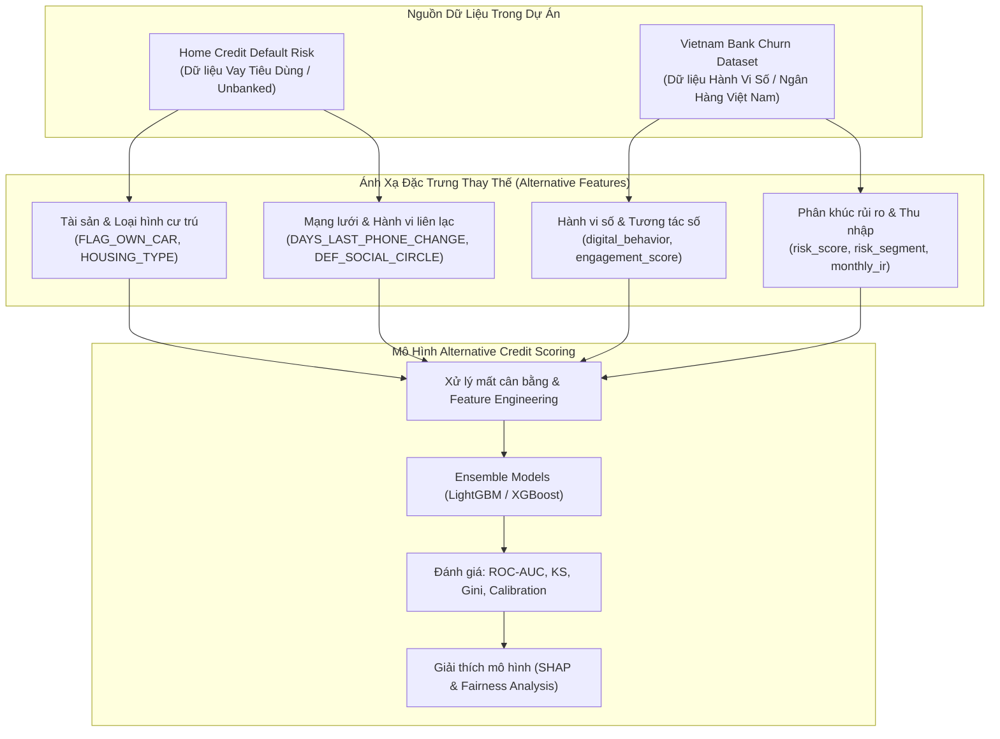

# 📄 Nghiên Cứu Chuyên Sâu: Alternative Credit Scoring (Đánh Giá Tín Dụng Bằng Dữ Liệu Thay Thế)

## 📌 1. Đặt Vấn Đề & Định Nghĩa (Introduction & Definition)

### 1.1 Khái niệm Alternative Credit Scoring (ACS)
**Alternative Credit Scoring (ACS)** là phương pháp đánh giá rủi ro tín dụng và xác suất vỡ nợ của khách hàng bằng cách khai thác các nguồn **Dữ Liệu Thay Thế (Alternative Data)** thay vì chỉ dựa vào lịch sử tín dụng truyền thống (Traditional Credit Bureau Data) từ các trung tâm thông tin tín dụng quốc gia (như CIC tại Việt Nam hay Experian/Equifax/TransUnion quốc tế).

### 1.2 So Sánh Traditional Credit Scoring vs. Alternative Credit Scoring

| Tiêu chí | Traditional Credit Scoring | Alternative Credit Scoring (ACS) |
| :--- | :--- | :--- |
| **Nguồn dữ liệu chính** | Lịch sử nợ quá hạn, hạn mức thẻ tín dụng, nợ ngân hàng, lịch sử tra cứu CIC | Hành vi số, viễn thông (Telco), giao dịch ví điện tử, e-commerce, thiết bị, nhân khẩu học |
| **Đối tượng áp dụng** | Khách hàng đã từng vay vốn / có thẻ tín dụng ngân hàng | Khách hàng "Thin-file" (ít dữ liệu) hoặc "Unbanked/Underbanked" (chưa có lịch sử nợ) |
| **Độ phủ (Inclusion)** | Hạn chế (Bỏ sót nhóm người trẻ, sinh viên, người làm tự do, nông dân) | Rất cao (Tiếp cận mọi cá nhân có sử dụng điện thoại thông minh/Internet) |
| **Tần suất cập nhật** | Định kỳ hàng tháng / hàng quý | Thời gian thực (Real-time) hoặc cận thời gian thực |
| **Thách thức kỹ thuật** | Dữ liệu cấu trúc sạch, số lượng biến ít | Dữ liệu phi cấu trúc, nhiễu cao, quy mô lớn, rủi ro thiên vị (Bias/Fairness) |

---

## 📚 2. Nguồn Tham Khảo Học Thuật & Tài Liệu Chính Thức (Literature Review)

1. **World Bank Group & CGAP (2017)** - *Alternative Data Assessing Credit Risk for Financial Inclusion*:
   - Nghiên cứu chỉ ra rằng việc tích hợp dữ liệu viễn thông (CDR - Call Detail Records), lịch sử nạp tiền điện thoại (Top-up) và hành vi ứng dụng di động giúp cải thiện độ chính xác phân loại rủi ro tín dụng lên đến **20-30%** đối với nhóm khách hàng lần đầu tiếp cận tín dụng.
   - Nguồn: [World Bank / CGAP Report 2017](https://www.cgap.org/publications/alternative-data-assessing-credit-risk-financial-inclusion)

2. **Óskarsdóttir et al. (2019)** - *The value of big data for credit scoring: Enhancing financial inclusion using mobile phone data* (IEEE Transactions on Knowledge and Data Engineering / ScienceDirect):
   - Chứng minh rằng các biến số viễn thông (thâm niên thuê bao, mức độ liên lạc, biến động vị trí địa lý) khi kết hợp với thuật toán Gradient Boosting (XGBoost/LightGBM) mang lại chỉ số **AUC > 0.78** trên dữ liệu khách hàng không có lịch sử nợ ngân hàng.
   - DOI: [10.1016/j.eswa.2019.02.029](https://doi.org/10.1016/j.eswa.2019.02.029)

3. **Bazarbash, M. (2019)** - *Fintech in Financial Inclusion: Machine Learning Applications in Credit Scoring* (IMF Working Paper):
   - Phân tích ưu thế của các mô hình phi tuyến tính (Random Forest, Tree-based Ensembles, Neural Networks) trong việc bắt cặp mối quan hệ phi tuyến giữa dữ liệu hành vi số và xác suất nợ xấu.
   - Nguồn: [IMF Working Paper WP/19/109](https://www.imf.org/en/Publications/WP/Issues/2019/05/17/Fintech-in-Financial-Inclusion-Machine-Learning-Applications-in-Credit-Scoring-46862)

4. **Kaggle Home Credit Default Risk Competition (2018)**:
   - Cuộc thi chính thức từ Home Credit Group công bố bài toán dự đoán vỡ nợ cho khách hàng bị từ chối bởi các ngân hàng truyền thống, cung cấp tập dữ liệu tiêu chuẩn cho nghiên cứu Alternative Credit Scoring.
   - URL: [https://www.kaggle.com/competitions/home-credit-default-risk](https://www.kaggle.com/competitions/home-credit-default-risk)

---

## 🔍 3. Phân Tích & Phân Loại Các Nguồn Dữ Liệu Thay Thế (Alternative Data Taxonomy)

### 3.1 Dữ Liệu Viễn Thông & Thiết Bị (Telco & Device Data)
- **Thuộc tính**: Loại thiết bị (Smartphone vs Feature phone, iOS vs Android), tuổi thọ thiết bị, thâm niên sử dụng SIM, tần suất nạp tiền (Top-up frequency), thay đổi số điện thoại (`DAYS_LAST_PHONE_CHANGE`).
- **Ý nghĩa tín dụng**: Độ ổn định thiết bị và thâm niên SIM phản ánh độ ổn định cuộc sống và khả năng duy trì liên lạc khi đến hạn trả nợ.

### 3.2 Dữ Liệu Hành Vi Số & Tương Tác (Digital Behavior & Engagement)
- **Thuộc tính**: Điểm tương tác ứng dụng (`engagement_score`), thói quen sử dụng ứng dụng di động/web (`digital_behavior`), thời gian tạo tài khoản (`created_date`), số lượng dịch vụ đang dùng (`nums_service`).
- **Ý nghĩa tín dụng**: Khách hàng có độ tương tác cao và sử dụng nhiều dịch vụ kỹ thuật số thường có mức độ gắn kết tài chính tốt hơn.

### 3.3 Dữ Liệu Nhân Khẩu Học & Xã Hội Phi Truyền Thống (Alternative Demographics & Social Circle)
- **Thuộc tính**: Loại hình nhà ở (`NAME_HOUSING_TYPE`), trình độ học vấn (`NAME_EDUCATION_TYPE`), loại công việc/nghề nghiệp (`occupation`), số lượng người phụ thuộc (`CNT_CHILDREN`), chỉ số rủi ro mạng lưới xã hội (`OBS_30_CNT_SOCIAL_CIRCLE`, `DEF_30_CNT_SOCIAL_CIRCLE`).
- **Ý nghĩa tín dụng**: Giúp xây dựng bức tranh toàn diện về năng lực tài chính và môi trường sống mà không cần bảng lương ngân hàng.

---

## 🎯 4. Ánh Xạ Bộ Dữ Liệu Dự Án Vào Bài Toán Alternative Credit Scoring

Theo nguyên tắc làm việc trong **AGENTS.md**, chúng ta cần phân biệt rõ nguồn gốc và vai trò của từng bộ dữ liệu:

### 4.1 Bộ dữ liệu Home Credit Default Risk (`data/raw/home-credit-default-risk/`)
- **Vai trò**: Bộ dữ liệu chuẩn mực về rủi ro vỡ nợ (`TARGET`) cho bài toán cấp tín dụng tiêu dùng cho khách hàng **Thin-file / Unbanked**.
- **Các nhóm biến thay thế quan trọng**:
  - `DAYS_LAST_PHONE_CHANGE`, `FLAG_EMP_PHONE`, `FLAG_WORK_PHONE`, `FLAG_EMAIL`: Đặc trưng thâm niên liên lạc & số hóa.
  - `OBS_30_CNT_SOCIAL_CIRCLE`, `DEF_30_CNT_SOCIAL_CIRCLE`: Chỉ số rủi ro lan truyền qua mạng lưới xã hội.
  - `NAME_HOUSING_TYPE`, `NAME_EDUCATION_TYPE`, `OCCUPATION_TYPE`: Đặc trưng kinh tế - xã hội thay thế cho chứng minh thu nhập chính thức.
  - `EXT_SOURCE_1`, `EXT_SOURCE_2`, `EXT_SOURCE_3`: Điểm đánh giá tín dụng tổng hợp từ các bên đối tác thứ 3 (Third-party alternative scores).

### 4.2 Bộ dữ liệu Vietnam Bank Churn Dataset (`data/raw/vietnam-bank-churn-dataset-2025/`)
- **Vai trò**: Dữ liệu đại diện cho hành vi số và phân khúc rủi ro của khách hàng tại thị trường **Việt Nam**.
- **Cách tiếp cận khoa học**:
  - Biến mục tiêu gốc là `exit` (hành vi ngưng sử dụng dịch vụ). Trong nghiên cứu Alternative Credit Scoring, hành vi ngưng sử dụng hoặc giảm đột ngột mức độ tương tác (`engagement_score`, `last_transaction_month`) là **tín hiệu cảnh báo sớm (Early Warning Signal - EWS)** cho rủi ro suy giảm khả năng tài chính và rủi ro tín dụng.
  - Tận dụng các biến hành vi Việt Nam: `digital_behavior` (Mobile/Web), `risk_score`, `risk_segment`, `loyalty_level`, `monthly_ir`, `origin_province` để nghiên cứu hành vi tài chính số.

---

## 🛠️ 5. Quy Trình Machine Learning & Phương Pháp Đánh Giá (Framework)

Theo quy định bắt buộc trong **AGENTS.md**, quy trình huấn luyện và kiểm thử mô hình Alternative Credit Scoring tuân thủ 9 bước chuẩn mực:

1. **Xác định biến mục tiêu**: `TARGET` (Home Credit) hoặc chỉ số rủi ro tín dụng chuyển đổi từ hành vi số.
2. **Kiểm tra chất lượng dữ liệu**: Xử lý missing values (bằng chỉ số thiếu hoặc Imputation thích hợp cho biến thay thế), phát hiện outliers.
3. **Ngăn chặn Data Leakage**: Tách tập Train/Validation/Test nghiêm ngặt trước mọi bước biến đổi dữ liệu.
4. **Xây dựng Baseline Model**: Sử dụng **Logistic Regression** với Weight of Evidence (WoE) & Information Value (IV) - chuẩn mực ngành ngân hàng.
5. **So sánh với Mô hình Học máy Nâng cao**: Đào tạo và tinh chỉnh **Random Forest**, **XGBoost**, **LightGBM**, và **CatBoost**.
6. **Thước đo Đánh giá Mô hình (Evaluation Metrics)**:
   - **ROC-AUC (Area Under ROC Curve)**: Đánh giá khả năng phân tách giữa lớp rủi ro và không rủi ro.
   - **PR-AUC (Precision-Recall AUC)**: Thước đo quan trọng khi dữ liệu bị mất cân bằng nghiêm trọng (Default rate ~ 8%).
   - **KS Statistic (Kolmogorov-Smirnov)**: Đánh giá khoảng cách phân tách tối đa giữa hai phân phối nợ tốt và nợ xấu (Mục tiêu $KS > 40\%$).
   - **Gini Coefficient**: $Gini = 2 \times AUC - 1$.
   - **Calibration Curve (Brier Score)**: Kiểm tra xác suất dự báo có phản ánh đúng tỷ lệ rủi ro thực tế hay không.
7. **Giải thích Mô hình (Explainability)**: Sử dụng **SHAP (SHapley Additive exPlanations)** để giải thích tầm quan trọng của các biến thay thế ở cả cấp độ toàn cục (Global) và cá thể (Local Scorecard explanation).
8. **Phân tích Tính Công Bằng (Fairness & Bias Analysis)**: Đánh giá mức độ bình đẳng của mô hình giữa các nhóm giới tính (`CODE_GENDER`), nhóm tuổi, hoặc vùng miền (`origin_province`).

---

## 📌 6. Kết Luận & Kế Hoạch Triển Khai Tiếp Theo

1. **Cập nhật Notebook EDA**: Cập nhật cả 2 notebook EDA trong thư mục `notebooks/` để tập trung phân tích các đặc trưng dữ liệu thay thế (**Alternative Data Features**).
2. **Feature Engineering Cho ACS**:
   - Xây dựng các chỉ số tỷ lệ: `CREDIT_TO_INCOME_RATIO`, `ANNUITY_TO_INCOME_RATIO`, `EMPLOYMENT_TO_AGE_RATIO`.
   - Gom nhóm dữ liệu lịch sử tín dụng thay thế từ `bureau.csv` và `previous_application.csv`.
3. **Thử nghiệm Mô hình Baseline WoE + Logistic Regression**: Tiến hành xây dựng scorecard truyền thống làm baseline trước khi áp dụng LightGBM/XGBoost.
