# Báo Cáo Tổng Hợp Đề Xuất Tối Ưu Mô Hình Machine Learning
## Project: Alternative Credit Scoring (Home Credit 2018)

**Ngày cập nhật:** 08/08/2026  
**Phiên bản:** 3.0  
**Tác giả:** Antigravity AI Assistant  
**Trạng thái:** Đề xuất kỹ thuật chính thức (Technical Proposal)

---

##  EXECUTIVE SUMMARY

Báo cáo này tổng hợp toàn bộ các phân tích nguyên nhân kỹ thuật và đề xuất giải pháp tối ưu hóa cho pipeline Machine Learning trong dự án Alternative Credit Scoring (ACS), sau khi dự án cập nhật phiên bản mới tích hợp 4 mô hình (`LogisticRegression`, `LightGBM`, `XGBoost`, `CatBoost`) và phương pháp Ensemble Blending.

### Phân tích hiện trạng từ kết quả thực nghiệm:
- **LightGBM Champion (Đơn lẻ)**: Đạt **ROC-AUC 0.7661** (cao nhất trong 4 mô hình đơn).
- **Ensemble_Calibrated (Kết hợp)**: Đạt **ROC-AUC 0.7638** (thấp hơn mô hình đơn LightGBM).

### Phát hiện cốt lõi (Root Cause):
Hàm tối ưu trọng số blending `optimize_blending_weights` hiện tại sử dụng `scipy.optimize.minimize(method="SLSQP")` trên hàm mục tiêu `-roc_auc_score(...)`. Do `roc_auc_score` dựa trên thứ hạng (ranks), đây là một **hàm nấc (step function) không liên tục có đạo hàm bằng 0 tại hầu hết các điểm** ($\nabla f = 0$). Thuật toán `SLSQP` khi tính gradient số học bị dừng ngay tại điểm khởi tạo (`init_weights = [0.25, 0.25, 0.25, 0.25]`). Việc cào bằng 25% trọng số cho `LogisticRegression` (ROC-AUC 0.7507) đã kéo tụt hiệu năng tổng thể của Ensemble.

---

## 1. PHÂN TÍCH CHI TIẾT HIỆN TRẠNG MÔ HÌNH (BENCHMARK ANALYSIS)

Bảng so sánh hiệu năng trên tập Test Holdout từ kết quả vừa thực thi:

| Mô hình (Model) | Trọng số Blending (Weight) | ROC-AUC | PR-AUC | Gini | KS Stat | ECE |
|---|---:|---:|---:|---:|---:|---:|
| **LogisticRegression** | `0.2500` *(cào bằng)* | 0.7507 | 0.2316 | 0.5014 | 0.3752 | **0.0014** |
| **CatBoost** | `0.2500` *(cào bằng)* | 0.7616 | 0.2507 | 0.5232 | 0.3943 | 0.0036 |
| **XGBoost** | `0.2500` *(cào bằng)* | 0.7643 | 0.2499 | 0.5286 | 0.3995 | 0.0037 |
| **LightGBM** | `0.2500` *(cào bằng)* | **0.7661** | **0.2549** | **0.5321** | **0.4009** | 0.0035 |
| **Ensemble_Calibrated** | `0.2500` *(cào bằng)* | **0.7638** | 0.2518 | 0.5276 | 0.3988 | 0.0020 |

### 3 Điểm nghẽn kỹ thuật chính:
1. **Lỗi Gradient bằng 0 trong Tối ưu Trọng số**: `SLSQP` không thể tối ưu hóa trực tiếp hàm mục tiêu không có đạo hàm mịn như ROC-AUC.
2. **Tiền xử lý chưa tối ưu cho CatBoost**: Dữ liệu truyền vào CatBoost đã qua `OneHotEncoder`, triệt tiêu tính năng xử lý `cat_features` tự nhiên xuất sắc của CatBoost.
3. **Giới hạn không gian thuộc tính**: Pipeline đang chạy mặc định trên `feature_set="serving"` (44 biến), bỏ qua các tập thuộc tính gom nhóm sâu từ 6 bảng phụ (`bureau`, `previous_application`, `installments_payments`, v.v.).

---

## 2. KHUNG GIẢI PHÁP TỐI ƯU HÓA 6 TRỤ CỘT (6-PILLAR REMEDIATION PLAN)

```mermaid
flowchart TD
    A["Khung Tối Ưu Mô Hình ML (ACS)"] --> B["1. Tối Ưu Thuật Toán Blending & Stacking"]
    A --> C["2. Feature Engineering & Selection Nâng Cao"]
    A --> D["3. Chuẩn Hóa Preprocessing Cho Từng Model"]
    A --> E["4. Mở Rộng Dữ Liệu Full Feature Set (418 Features)"]
    A --> F["5. Probability Calibration & Rank Averaging"]
    A --> G["6. Cost-Sensitive Thresholding & Fairness Mitigation"]

    B --> B1["Thay SLSQP bằng Nelder-Mead / Optuna (Gradient-Free)"]
    B --> B2["Triển khai 5-Fold OOF Stacking Meta-Learner"]

    C --> C1["Biến đổi Weight of Evidence (WoE) & IV Filtering"]
    C --> C2["Tạo chỉ số phái sinh & Tương tác 3rd party scores"]

    D --> D1["Truyền cat_features nguyên bản cho CatBoost"]
    D --> D2["Scale & Impute riêng cho Logistic Regression"]

    E --> E1["Tích hợp Aggregations từ 6 bảng phụ"]
    E --> E2["Optuna 50-Trials Hyperparameter Tuning"]

    F --> F1["Percentile Rank Blending"]
    F --> F2["So sánh Platt vs Isotonic vs Beta Calibration"]

    G --> G1["Ngưỡng quyết định theo Loss Matrix (FN vs FP)"]
    G --> G2["Cân bằng Equalized Odds theo giới tính"]
```

---

### 2.1 Trụ cột 1: Tối Ưu Thuật Toán Blending & Stacking

#### A. Sửa lỗi Tối ưu Trọng số Blending (Blending Weight Optimization)
- **Giải pháp**: Thay thế `scipy.optimize.minimize(method="SLSQP")` bằng thuật toán tối ưu **Gradient-Free** như **Nelder-Mead** hoặc **Optuna TPE Sampler**.
- **Rank Averaging (Percentile Rank Blending)**: Chuyển đổi xác suất dự đoán $P_i$ của từng mô hình thành thứ hạng phần trăm $R_i \in [0, 1]$ trước khi nhân trọng số:
  $$\text{Blended Score} = \sum_{m=1}^{M} w_m \cdot \text{Rank}(P_m)$$
  *Tác dụng*: Triệt tiêu hoàn toàn sự chênh lệch về phân phối xác suất giữa các thuật toán.

#### B. 5-Fold Out-of-Fold (OOF) Stacking Meta-Learner
- Chia tập huấn luyện thành 5 Folds (Stratified K-Fold).
- Thu thập ma trận dự báo OOF $\hat{Y}_{OOF} \in \mathbb{R}^{N \times 4}$.
- Huấn luyện mô hình Meta-Learner (Ridge Classifier / Logistic Regression) trên $\hat{Y}_{OOF}$ để tìm trọng số kết hợp tối ưu không bị quá sắp xếp (Data Leakage).

---

### 2.2 Trụ cột 2: Advanced Feature Engineering & Selection

1. **Weight of Evidence (WoE) & Information Value (IV) Selection**:
   - Chuyển đổi toàn bộ biến continuous & categorical sang giá trị WoE cho Logistic Regression Scorecard.
   - Sàng lọc chỉ giữ các biến có $0.02 \le IV \le 0.50$ [Siddiqi, 2017].
2. **Chỉ số phái sinh ACS & Tương tác 3rd Party**:
   - `EXT_SOURCE_MEAN = mean(EXT_SOURCE_1, EXT_SOURCE_2, EXT_SOURCE_3)`
   - `EXT_SOURCE_PRODUCT = EXT_SOURCE_1 * EXT_SOURCE_2 * EXT_SOURCE_3`
   - `CREDIT_TO_INCOME = AMT_CREDIT / AMT_INCOME_TOTAL`
   - `ANNUITY_TO_INCOME = AMT_ANNUITY / AMT_INCOME_TOTAL`
   - `EMPLOYMENT_TO_AGE = DAYS_EMPLOYED / DAYS_BIRTH`

---

### 2.3 Trụ cột 3: Chuẩn Hóa Preprocessing Riêng Cho Từng Thuật Toán

- **CatBoost Classifier**: Truyền trực tiếp chuỗi danh mục nguyên bản và khai báo tham số `cat_features`. Không dùng One-Hot Encoder trước CatBoost.
- **LightGBM & XGBoost**: Sử dụng Histogram-based Categorical Split nguyên bản.
- **Logistic Regression**: Áp dụng `SimpleImputer(strategy='median')` + `StandardScaler()` + WoE Encoding.

---

### 2.4 Trụ cột 4: Mở Rộng Dữ Liệu Full Feature Set (418 Features) & Hyperparameter Tuning

1. Chuyển từ `feature_set="serving"` (44 biến) sang `feature_set="full"` (418 biến bao gồm các thống kê `mean`, `max`, `min`, `sum` từ `bureau`, `previous_application`, `installments_payments`, `POS_CASH_balance`, `credit_card_balance`).
2. Chạy **Optuna Bayesian Optimization** (50 trials/mô hình) để tìm tham số tối ưu cho LightGBM, XGBoost, CatBoost.

---

### 2.5 Trụ cột 5: Hiệu Chỉnh Xác Suất (Calibration) & Rank Averaging

- **Hiệu chỉnh xác suất đơn lẻ**: Áp dụng **Isotonic Regression** hoặc **Beta Calibration** [Kull et al., 2017] cho từng mô hình trước khi Blending.
- **Đánh giá Calibration**: Kiểm soát chỉ số **Expected Calibration Error (ECE < 0.005)** và **Brier Score**.

---

### 2.6 Trụ cột 6: Cost-Sensitive Thresholding & Fairness Mitigation

1. **Ma trận Chi phí Tài chính (Cost Matrix Loss)**:
   $$L(h) = C_{FN} \cdot P(FN) + C_{FP} \cdot P(FP)$$
   Với $C_{FN} / C_{FP} = 5.0$ (Tổn thất khi duyệt nhầm hồ sơ vỡ nợ gấp 5 lần chi phí cơ hội từ chối nhầm khách hàng tốt).
2. **Fairness Adjustment (Equalized Odds)**:
   Tự động tinh chỉnh ngưỡng quyết định riêng cho nhóm nam/nữ (`CODE_GENDER`) để thu hẹp khoảng cách TPR/FPR gap ($< 3\%$) mà vẫn bảo toàn Gini stability [Hardt et al., 2016].

---

## 3. LỘ TRÌNH VÀ DANH SÁCH TỆP MÃ NGUỒN CẦN CHỈNH SỬA

| Tệp mã nguồn | Hành động | Nội dung chỉnh sửa chi tiết |
|---|---|---|
| [src/credit_scoring/ensemble_pipeline.py](file:///d:/AI_Vin/T080-One_Last_Time/src/credit_scoring/ensemble_pipeline.py) | [MODIFY] | 1. Sửa `optimize_blending_weights`: Thay `SLSQP` bằng `Nelder-Mead` / `Optuna`. 2. Thêm hàm `rank_averaging_transform()`. 3. Phân tách preprocessor: Giữ `cat_features` cho CatBoost. 4. Tích hợp 5-Fold OOF prediction pipeline. |
| [scripts/train_ensemble.py](file:///d:/AI_Vin/T080-One_Last_Time/scripts/train_ensemble.py) | [MODIFY] | 1. Thêm tham số CLI `--feature-set full` và `--tune`. 2. Xuất báo cáo trọng số blending chính xác sau tối ưu. 3. Lưu artifact Ensemble đã hiệu chuẩn. |
| [src/credit_scoring/features.py](file:///d:/AI_Vin/T080-One_Last_Time/src/credit_scoring/features.py) | [MODIFY] | Tích hợp tính toán WoE / IV transformer và các biến phái sinh tương tác mới. |
| [src/credit_scoring/metrics.py](file:///d:/AI_Vin/T080-One_Last_Time/src/credit_scoring/metrics.py) | [MODIFY] | Bổ sung hàm tính Cost-Sensitive Loss, Beta Calibration, và Equalized Odds threshold selector. |
| [tests/test_ensemble_pipeline.py](file:///d:/AI_Vin/T080-One_Last_Time/tests/test_ensemble_pipeline.py) | [NEW] | Unit tests kiểm thử thuật toán Nelder-Mead, Rank Averaging, và OOF Stacking Meta-Learner. |

---

## 4. BẢNG MỤC TIÊU ĐÁNH GIÁ (TARGET BENCHMARKS)

| Chỉ số (Metric) | Hiện tại (`Ensemble_Calibrated`) | Mục tiêu Sau Tối Ưu | Phương pháp đạt mục tiêu |
|---|---:|---:|---|
| **ROC-AUC (Test Holdout)** | 0.7638 | **$\ge 0.7880 - 0.7950$** | Full Feature Set + Nelder-Mead / OOF Stacking |
| **PR-AUC (Test Holdout)** | 0.2518 | **$\ge 0.2750$** | Optuna Hyperparameter Tuning + CatBoost `cat_features` |
| **Gini Coefficient** | 0.5276 | **$\ge 0.5760$** | Rank Averaging Blending |
| **KS Statistic** | 0.3988 | **$\ge 0.4300$** | Multi-table aggregations (`bureau`, `installments`) |
| **ECE (Expected Calibration Error)** | 0.0020 | **$< 0.0030$** | Beta / Isotonic Calibration |
| **Gender TPR Gap** | 8.41% | **$< 3.00\%$** | Equalized Odds Threshold Correction |

---

## 5. TÀI LIỆU THAM KHẢO HỌC THUẬT (ACADEMIC REFERENCES)

1. **Siddiqi, N. (2017)**. *Intelligent Credit Scoring: Building and Implementing Better Credit Risk Scorecards*. John Wiley & Sons. DOI: [10.1002/9781119282396](https://doi.org/10.1002/9781119282396).
2. **Kull, M., Silva Filho, T. M., & Flach, P. (2017)**. *Beta calibration: a well-founded and scalable alternative to Platt scaling for binary classification*. AISTATS 2017. arXiv: [1701.05105](https://arxiv.org/abs/1701.05105).
3. **Wolpert, D. H. (1992)**. *Stacked generalization*. Neural Networks, 5(2), 241-259. DOI: [10.1016/0893-6080(92)90023-L](https://doi.org/10.1016/0893-6080(92)90023-L).
4. **Chen, T., & Guestrin, C. (2016)**. *XGBoost: A Scalable Tree Boosting System*. KDD '16. DOI: [10.1145/2939672.2939785](https://doi.org/10.1145/2939672.2939785).
5. **Prokhorenkova, L., et al. (2018)**. *CatBoost: unbiased boosting with categorical features*. NeurIPS 2018. arXiv: [1810.11363](https://arxiv.org/abs/1810.11363).
6. **Lundberg, S. M., & Lee, S. I. (2017)**. *A unified approach to interpreting model predictions*. NeurIPS 2017. arXiv: [1705.07874](https://arxiv.org/abs/1705.07874).
7. **Hardt, M., Price, E., & Srebro, N. (2016)**. *Equality of Opportunity in Supervised Learning*. NeurIPS 2016. arXiv: [1610.02413](https://arxiv.org/abs/1610.02413).
